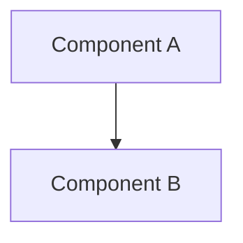

# Project Summary

## Purpose
[What problem this project solves and why it exists]

## Architecture

## Key Components
- **Component A**: Responsibility and location
- **Component B**: Responsibility and location

## Dependencies
- Primary: [list]
- Development: [list]

## Current Status
- Implemented: [features]
- In Progress: [features]
- Planned: [features]
